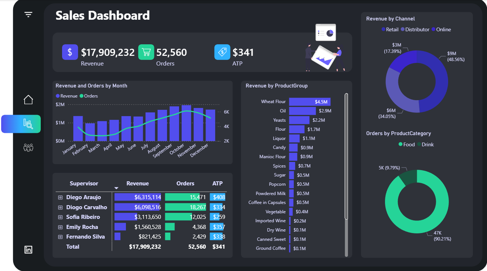

# 📊 SalesInsight BI – Sales Performance Analytics Dashboard

## 📌 Project Overview
SalesInsight BI is an interactive Power BI dashboard developed to analyze sales performance across multiple business dimensions including revenue trends, order volume, product performance, and channel distribution.

The dashboard converts raw sales data into structured KPIs and visual insights to support data-driven decision making.

---

## 📊 Key KPIs

- Total Revenue: $17.9M
- Total Orders: 52,560
- Average Transaction Price (ATP): $341

---

## 🛠 Tools & Technologies
- Power BI
- DAX (Data Analysis Expressions)
- Power Query
- Data Modeling
- Excel Dataset

---

## ⚙️ Data Preparation & Modeling
- Cleaned and transformed sales data using Power Query
- Built structured data model linking products, sales, and calendar tables
- Created calculated measures using DAX for revenue and performance metrics
- Implemented interactive slicers for dynamic analysis

---

## 📈 Dashboard Features

### 1️⃣ Revenue Trend Analysis
Tracks monthly revenue and order volume to identify seasonal sales patterns and performance fluctuations.

### 2️⃣ Product Group Performance
Analyzes revenue contribution by product categories to identify best-selling items.

### 3️⃣ Sales Channel Distribution
Breaks down revenue by sales channels such as Retail, Distributor, and Online.

### 4️⃣ Supervisor Performance Analysis
Evaluates supervisor performance based on revenue, orders, and transaction value.

---

## 📊 Business Insights Generated
- Identified top-performing product groups
- Revealed revenue contribution by sales channel
- Highlighted sales performance across supervisors
- Detected monthly trends in revenue and order growth

---

## 📷 Dashboard Preview

---

## 🚀 Future Enhancements
- Add predictive sales forecasting
- Integrate SQL database pipeline
- Deploy dashboard through Power BI Service

---

## 👨‍💻 Author
Ahmed Saied Ahmed  
Data Scientist | AI & Business Intelligence Enthusiast
